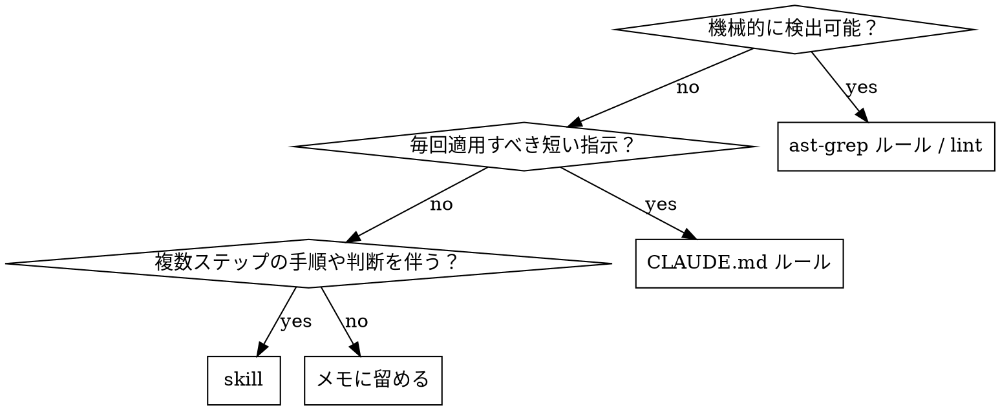

# レトロスペクティブ体系化

タスクの終盤で「最初にこれを知っていれば遠回りしなかった」知見を抽出し、静的ルール・skill・常時有効ルールのいずれかに固定する。プロンプトに頼らず再現可能な形に落とすことを優先する。

## Mise: 完了前に必ず意識する

**学びの反映がコード・`issues`・`scripts`に及ぶなら、報告前に下を実行し通す。** `mise`なしは`scripts/manager`同一名。初回: `mise trust`（[mise trust](https://mise.jdx.dev/cli/trust.html)）

- ルールや`scripts`を直した: `mise run check-scripts`および`mise run check-repo-smoke`
- `issues` / PR方針を直した: `mise run check-issue-health`と`mise run update-issue-index`（必要に応じ`scripts/manager update-issue-index --check`）
- Rust/テスト手直しを含めた: `mise run fmt`と`mise run nextest`

## いつ使うか

- タスク完了直前、またはユーザーから「学びを残して」「ルール化して」と指示されたとき
- 試行錯誤の末に解にたどり着いたとき（初手で詰まった、誤った仮説を立てた、ドキュメント不足で時間を溶かした等）
- 同種のタスクを将来また行う可能性があるとき

使わない場面:

- 一発で通った単純なタスク（抽出する学びがない）
- プロジェクト固有の一回限りの対応（コミットメッセージで十分）

## ワークフロー

1. **失敗⇄成功の対応付け**: 今回のタスクから次の3点を書き出す。
   - 最初の試行（何をした / どう失敗した）
   - 最終解（何が効いた）
   - 橋渡しになった気付き（なぜ最初の試行では届かなかったか）
2. **「最初に知るべきだったこと」の言語化**: 気付きを1〜3文で要約する。回顧でなく、未来の自分への指示形で書く（"〜するな" / "〜を先に確認せよ"）。
3. **分類**: 下の判定表に従って出力先を決める。
4. **重複チェック（必須）**: 提案前に既存の知見と照合する。重複や近接する規則があれば「新規追加」ではなく「既存への追記 / 更新」を選ぶ。これを怠るとskill / ルールが肥大化する。

   検索キー候補は気付きから2〜3語抽出する（ツール名・API名・症状語・対義語）。例: 気付きが「pnpm v10を使う」なら`pnpm`、`packageManager`、`lockfile`。

   照合先と最低限の検索:

   ```
   # skill重複（global）
   ls .agents/skills/
   Grep "<キー>" .agents/skills/*/SKILL.md

   # CLAUDE.md重複
   Grep "<キー>" ~/.claude/CLAUDE.md
   Grep "<キー>" <project-root>/CLAUDE.md   # 該当プロジェクトがある場合

   # lintルール重複
   ls <project-root>/rules/
   Grep "<キー>" <project-root>/rules/
   ```

   結果を4段階に分類:
   - **新規**: ヒット無し → 通常の提案
   - **既存追記**: 関連skill/ルールが存在し、追加情報が補完的 → 「既存に追記」を提案
     - 「部分重複」（学びの一部だけが既存カバー、残りが新規）もこの分類に含める。重複した部分は「重複検出」節に、新規部分は「採用候補」節（`[skill 追記]`または`[rule]`）に分けて書く。
   - **既存と重複（提案不要）**: 既存が同じ知見を完全にカバー済み → 提案ゼロ、ただし提示フォーマットには「重複検出」行を残す（監査可能性のため）。重複検出行には根拠として既存skill名 + 該当節名（または行番号）を添える。
   - **判断保留**: 重複かどうかagentが判定できない → ユーザーに照合結果を見せて判断を仰ぐ
5. **書き出し**: 選んだ形式のテンプレート（後述）に沿ってartifactを生成する。
6. **確認**: ユーザーにdiffを見せて採用可否を取る。棄却された場合はskillではなくセッション内のメモに留める。

## 分類判定



| 判定軸 | 出力先 | 例 |
|---|---|---|
| コード/設定の構文レベルで検出可能 | `ast-grep`ルールまたは既存linter設定 | "`Array.from(set).length`を使うな、`set.size`を使え" |
| 短く、常時適用、判断を伴わない | `CLAUDE.md`（user global / project） | "pnpmはv10以上を使う" |
| 手順・文脈判断・テンプレが必要 | 新規skillまたは既存skillへの追記 | "MoonBitのC bindingを書く手順" |
| プロジェクト固有で一回限り | 採用しない（コミットメッセージ / PR説明に留める） | — |

**ast-grepを優先する原則**: 静的に検出可能なものはプロンプトやドキュメントに書かず、必ず`ast-grep`ルールにする（ユーザーのglobalルール）。

**CLAUDE.mdの書き出し先**:

- 言語横断・ツール横断の一般則 → `~/.claude/CLAUDE.md`
- 特定リポジトリ限定 → そのリポジトリの`CLAUDE.md`

## 出力テンプレート

### ast-grepルール

`ast-grep-practice` skillを参照。`rules/`ディレクトリにYAMLを追加し、`rule-tests/`にvalid / invalidペアを必ず書く。

### CLAUDE.mdへの追記

```markdown
# <既存セクションに追記>
- <命令形の1文>（理由: <短い根拠>）
```

理由を括弧書きで必ず添える（将来の自分がedge caseを判断できるように）。

### 新規skill

```markdown
---
name: <kebab-case>
description: <具体的な状況> / <症状>のときに使用
---

# <Title>

## 目的
## いつ使うか
## ワークフロー
## 落とし穴
```

## 具体例

### 例1: ast-grepルール化（機械検出可能）

- 最初の試行: TypeScriptで集合のサイズを`Array.from(set).length`で取得していたが、レビューで非効率と指摘された。
- 最終解: `set.size`を使う。
- 気付き: `Set` / `Map`のサイズ取得は`.size`プロパティを使う。`Array.from(...).length`は構文レベルで検出可能。

`rules/no-array-from-size.yml`を追加:

```yaml
id: no-array-from-size
language: TypeScript
severity: warning
rule:
  pattern: Array.from($COLL).length
message: Set/Mapのサイズは.sizeプロパティを使う。
```

### 例2: CLAUDE.mdルール化（短い常時ルール）

- 最初の試行: `pnpm install`を実行したらlockfile形式の差分でCIが落ちた。
- 最終解: pnpmのバージョンをv10系に揃えた。
- 気付き: pnpmはバージョン差でlockfileが変わる。常にv10以上を使う。

`~/.claude/CLAUDE.md`の「ツール」節に追記:

```markdown
- pnpmはv10以上を使う（理由: lockfile形式がv9以前と非互換でCI差分が出る）
```

### 例3: 新規skill化（手順 + 判断を伴う）

- 最初の試行: MoonBitからCライブラリを呼ぶのに、いくつかの方法を試してFFI宣言とstubの配置で詰まった。
- 最終解: `extern "c"`宣言 + `moonbit.h`を使ったstub + `moon.pkg.json`の`native-stub` / `link.native`設定の組み合わせ。
- 気付き: 単一手順では収まらず、宣言・stub・ビルド設定の3層を一括して理解する必要がある。

新規skill `moonbit-c-binding`として手順とテンプレを切り出し（既に存在するため、本例は「重複チェックで既存への追記」を選ぶケース）。

## Red flags（合理化に注意）

下記の思考が出たら一度止まる。

| 出てくる合理化 | 実態 |
|---|---|
| 「プロジェクト固有だけど一応skillにしておこう」 | skillが肥大化し検索性が落ちる。コミットメッセージ / PRで十分。 |
| 「承認は省いて先に書き出しておこう、後で見せればいい」 | 勝手にCLAUDE.md / skillを変更すると将来の挙動が読めなくなる。必ず提案 → 承認 → 書き出し。 |
| 「ast-grepで書ける気もするけど、自然言語でルールに書いた方が早い」 | 静的検出可能なものを散文で書くと、エージェントが守らない。ast-grepを優先。 |
| 「気付きが薄いけど、何か書かないと格好がつかない」 | 提案ゼロも正解。空のretrospectiveは害がない。 |
| 「重複チェックは面倒だから飛ばそう、被ったら後で消せばいい」 | 重複ルールが残ると挙動が割れる。dedupは必須工程。 |
| 「失敗の側は省いて、最終解だけ書けばいい」 | 失敗の記述がないと、将来の自分は同じ落とし穴に再度落ちる。 |

## ユーザーへの提示フォーマット

タスク終了時に次の形で棚卸しを提示。**学びは複数あって良い。重複や不採用も明示的に列挙して、判断の足跡を残す。**

```
## Retrospective

### 学び1: <短いラベル>
- 最初の失敗: <1行>
- 最終解: <1行>
- 気付き: <1行>

### 学び2: <短いラベル>      # 学びが1つだけならこのブロックは省く
- 最初の失敗: <1行>
- 最終解: <1行>
- 気付き: <1行>

## 提案

採用候補:
- [lint] <ルール名>: <1行>（artifact: <path>, 学びN由来）
- [skill 追記] <既存skill名>: <1行>（学びN由来）
- [skill 新規] <skill名>: <1行>（学びN由来）
- [rule] CLAUDE.md（global/project）: <1行>（学びN由来）

重複検出（提案不要）:
- <学びN>: 既存<skill/rule名>の<該当節名 or 行番号>が完全カバー → 追加なし

不採用:
- <学びN>: <不採用理由1行>（例: プロジェクト固有 / cross-fileでlint表現困難 / 他の学びに吸収）

採用するものを番号または項目名で指示してください。提案ゼロも妥当な結論です。
```

**書式ルール:**

- 学びが1つなら`### 学びN`見出しは省き、Retrospectiveブロックを1つだけ書く
- 「採用候補」「重複検出」「不採用」のいずれかが空ならその節ごと省く（"なし"行は書かない）
- 各提案行末に「学びN由来」を必ず書く（複数学びを跨ぐ場合は「学び1, 3由来」のように列挙して良い）
- 「採用候補」が空で「重複検出」のみ残るときは、末尾文を`採用するものを指示してください`ではなく`採用候補なし。記録目的でレビューしてください。`に置き換える
- ユーザーが採用を指示した項目のみ書き出す。黙って書き出さない

### 提示例: 全学びが既存カバー（重複検出のみ）

```
## Retrospective

### 学び1: <ラベル>
- 最初の失敗: ...
- 最終解: ...
- 気付き: ...

## 提案

重複検出（提案不要）:
- 学び1: 既存skill `<skill名>` の `<節名>` が完全カバー → 追加なし

採用候補なし。記録目的でレビューしてください。
```

### 提示例: 部分重複（既存追記 + 重複検出）

```
## 提案

採用候補:
- [skill 追記] <既存skill名>: <新規部分の1行>（学び1由来, 既存節`<節名>`への補完）

重複検出（提案不要）:
- 学び1（version値部分）: 既存`~/.claude/CLAUDE.md`ツール節が既にカバー → 追記不要
```

## よくある失敗

- **粒度が細かすぎる**: その一回限りの事情（特定の関数名、特定のバージョン）までルール化してしまう → 抽象化して「何を確認するか」レベルに引き上げる
- **プロンプトで書きがち**: 静的に検出可能な規則を自然言語でCLAUDE.mdに書く → `ast-grep`ルールに移す
- **理由を書かない**: ルールの根拠が残らず、将来の自分がなぜそれを守るのか判断できなくなる → 必ず`Why:`を添える
- **勝手に書き出す**: ユーザー承認なしにCLAUDE.mdやskillを更新する → 必ず提案 → 承認 → 書き出しの順を守る
- **失敗の言語化を省く**: 「最終解はX」だけ書いて、なぜ初手で詰まったかを残さない → 失敗側の記述がないと、将来の自分は同じ落とし穴にまた落ちる

## 関連スキル

- ast-grep-practice: 学びからのast-grepルール作成用
- docs-workflow: 学びによるドキュメント更新用
- issues-workflow: 改善作業の追跡用
