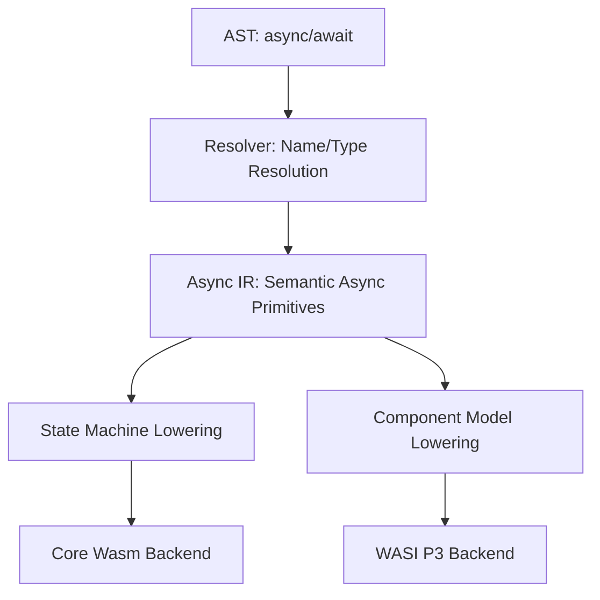

# Async/Await Design

この文書は ts2wasm における `async`/`await` の設計を定める。

## 設計思想: Multi-target Async

ts2wasm では、単一の非同期実装に固執せず、ターゲット環境に最適な下層実装を選択しつつ、言語層のセマンティクスを共通化する。

| Target | 実装方式 | 特徴 |
|---|---|---|
| **Core Wasm (iwasm/WAMR)** | **State Machine (状態機械)** | スタック巻き戻しを伴わない純粋な WASM 命令への変換。高いポータビリティ。 |
| **Wasm + JS (Browser/Node)** | **State Machine + JS Promise Wrapper** | 状態機械を JS の Promise でラップして駆動。JSPI (JS Promise Integration) への移行パスを確保。 |
| **WASI P3 (Component Model)** | **Native Async (future/stream)** | WASI 0.3 / Component Model の非同期命令へ直接マッピング。 |

## Compiler Pipeline での扱い

フロントエンドからバックエンドまで、共通の **Async IR** を経由する。



### Async IR (Semantic HIR 拡張)

`crates/ir/src/semantic.rs` において、以下のプリミティブを定義する。

- **`AsyncFunction`**: `ResolvedFunction` の拡張。`is_async` フラグを持ち、戻り値を `Promise` 互換のハンドルとして扱う。
- **`SuspendPoint`**: `await` 式に相当。現在の実行状態（ローカル変数、再開地点）を保存して呼び出し元に制御を戻す地点。
- **`Awaitable`**: 非同期操作の抽象化。Host capability、JS Promise、WASI future などを統一的に扱う。

## Core Wasm: State Machine Lowering

`iwasm` 等の環境では、`async` 関数を再開可能な状態機械に変換する。

### 1. Frame Lifting

関数のローカル変数を、ヒープ上の「フレームオブジェクト」に移動する。
これにより、関数を一旦抜けても次回の呼び出し時に状態を復元できる。

### 2. 再開ポイントの制御

`await` 地点ごとに `state_id` を割り振り、関数冒頭で `br_table` を用いて該当箇所へジャンプする。

```wat
(func $async_fn (param $frame_ptr i32) (result i32)
  (block $entry
    (block $state_1
      (block $state_0
        ;; 状態に応じてジャンプ
        (br_table $state_0 $state_1 (i32.load (local.get $frame_ptr)))
      )
      ;; State 0: 初期実行
      ...
      ;; await 発生
      (i32.store (local.get $frame_ptr) (i32.const 1)) ;; 次の状態を保存
      (return (i32.const $STATUS_PENDING))
    )
    ;; State 1: 再開
    ...
  )
)
```

## Runtime ABI: Polling モデル

非同期タスクの管理には、ポーリングベースの ABI を使用する。

| Function | Signature | Notes |
|---|---|---|
| `task_poll` | `(task_id) -> status` | `PENDING`, `READY`, `REJECTED` を返す。 |
| `task_result` | `(task_id) -> jsval` | 完了したタスクの結果を取得。 |
| `task_drop` | `(task_id) -> void` | タスクの破棄とメモリ解放。 |

### Wasm + JS での駆動

JS ターゲットでは、Wasm 側の状態機械を JS のマイクロタスク（`queueMicrotask`）でポーリングするラッパーを生成する。これにより、Wasm 側は状態機械の実装を一つに保ちつつ、JS の非同期エコシステムと統合できる。

## WASI P3 / Component Model への展望（deferred — tracked as id 187）

WASI 0.3 (Preview 3) では、WIT (WebAssembly Interface Type) レベルで `async func` がサポートされる。

- `future<T>`: 単一の非同期値。
- `stream<T>`: 非同期的な値の列。

`ts2wasm` の Async IR は、これらの命令へ直接マッピング可能な抽象度を維持する。Component Model backend では、`SuspendPoint` は Canonical ABI の非同期命令（`canon lift` / `lower` の async オプション）として出力される。
